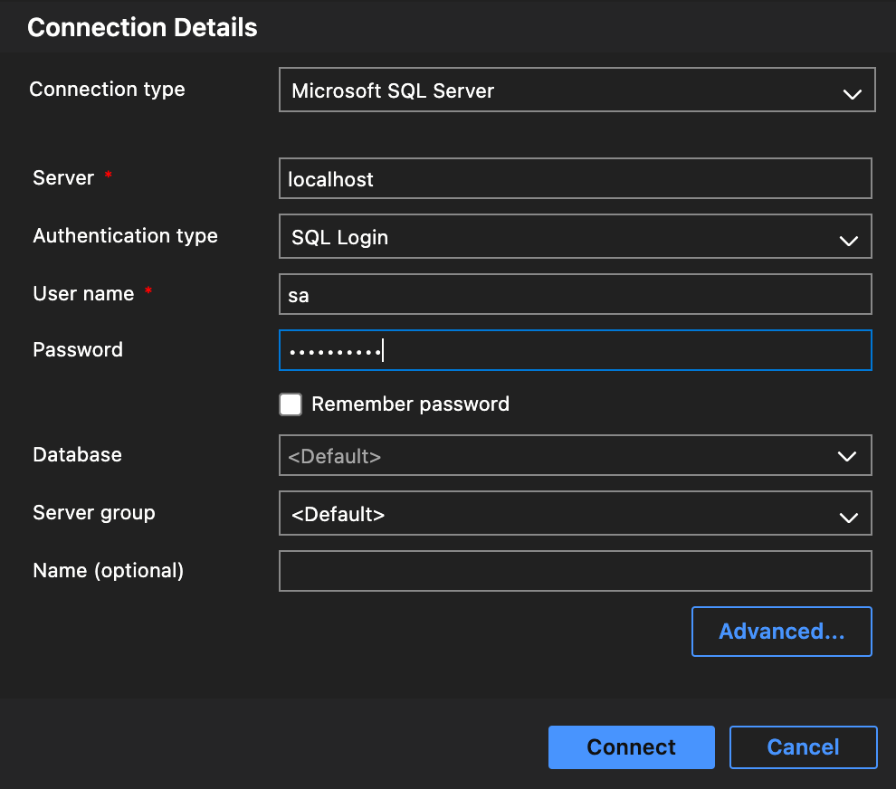
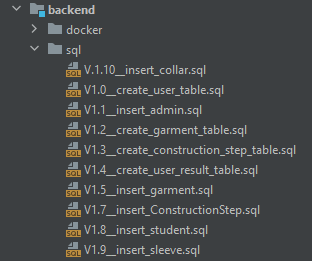
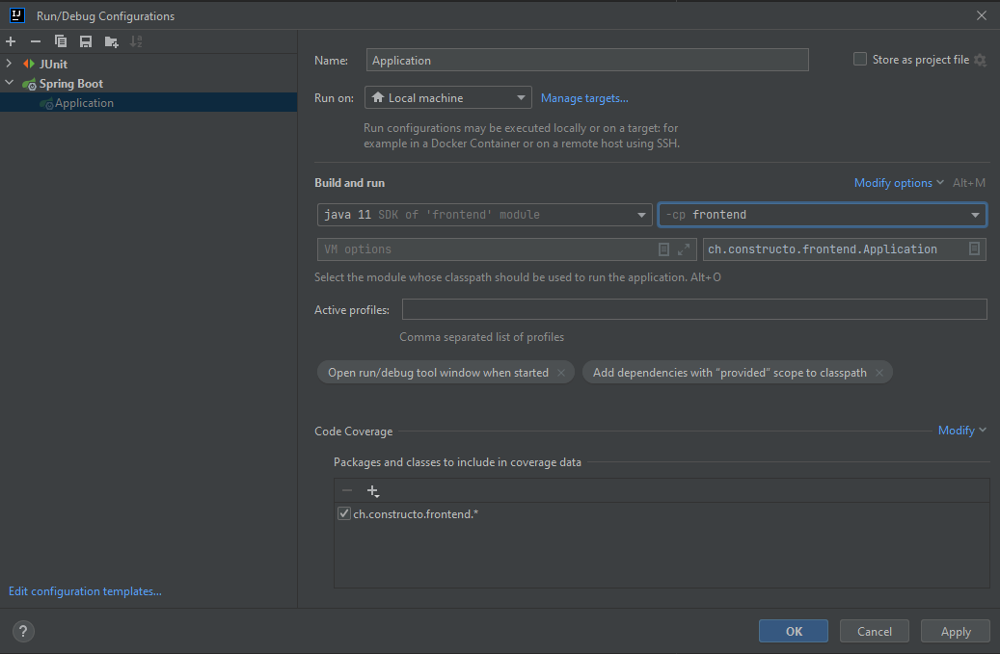

# Constructo #

> Constructo is an application used in fashion schools.
Its main purpose is to help student in their learning process.
The first feature implemented for now is a digitization for the school subject: Efficient Work Planning. This subject teaches the right and most efficient ways of garment construction.

## Table of contents ##

1. [Project Description](#heading)
2. [Technologies](#heading-1)
3. [How to install and run the project](#heading-2)

## Technologies ##

* Java 11
* Maven
* Spring
* Spring Boot
* Docker Container
* Sql Servre (Mssql)
* Vaadin
* JavaScript
* TypeScript
* HTML5
* CSS3

## How to install and run the project

In order to install and run the project on your locale machine, the following must be done:
(recommendet IDEA: IntelliJ)

1. Make sure you have JDK 11 installed. (Tip: if you open the project within IntelliJ, you can download the right JDK automatically in the project's settings)
2. Make sure you have node v.16.0.0 or above installed.
3. Make sure you have Maven v.3.0.0 or above installed.
    * Windows installation: https://phoenixnap.com/kb/install-maven-windows
    * Mac installation: https://javabydeveloper.com/how-to-install-maven-on-mac-osx
4. Clone the project from GitHub -> https://gitbug.com/NoeliaChicharro/constructo_code
5. Open project in IntelliJ and hit the "Trust Project" Button. -> *File - Open - select pom.xml from root - open as project*
    * if project tab does not show backend and frontend dirs as modules follow instructions in [trustProject]
6. Run 'npm install'
7. Execute a clean and install maven build, skipping tests.  
    * if the build fails run 'npm install' within frontend module, and rerun build
8. Make sure you have Azure Data Studio installed -> https://docs.microsoft.com/en-us/sql/azure-data-studio/download-azure-data-studio?view=sql-server-ver16
9. Make sure you have Docker Desktop installed
    * Windows installation: https://docs.docker.com/desktop/windows/install/
    * Mac installation: https://docs.docker.com/desktop/mac/install/
10. Download mssql server image
    `docker run -e "ACCEPT_EULA=Y" -e "SA_PASSWORD=wuschtel5!" -p 1433:1433 -d mcr.microsoft.com/mssql/server:2019-latest`
11. Create new connection in Azure Data Studio (password: wuschtel5! (as in run command))  
      
12. Execute sql scripts in named order  
     
13. Execute another maven clean and install, this time without skipping tests
14. Add Application as run configuration  
      
    * or run application from Application.java (which will automatically create a run confoguration)
15. Open browser on http://localhost:8080
16. Login with one of the pre-stored users.
  

